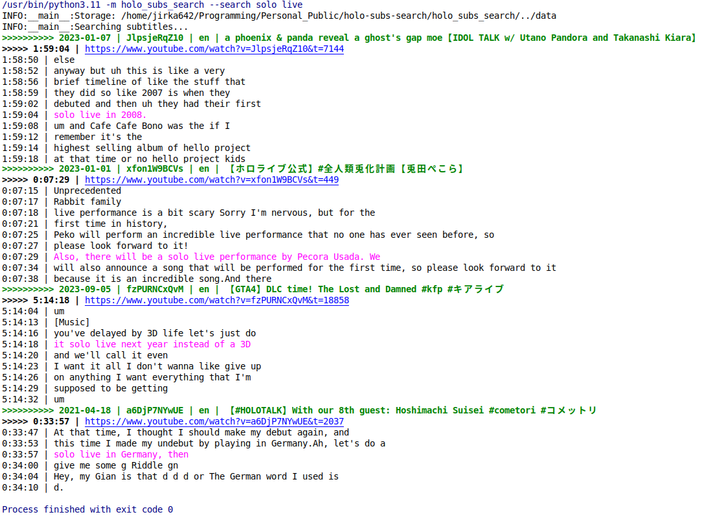

# HoloSubs Search

Tool for searching transcriptions of vtuber videos.

Uses:
- Metadata from [Holodex](https://holodex.net)
- Subtitles and audio from Youtube
- [pyannote-audio](https://github.com/pyannote/pyannote-audio) for speaker diarization
- [Whisper](https://github.com/fedirz/faster-whisper-server) for transcription




## Setup

- Use Python 3.11+
- Install dependencies with `python3.11 -m pip install -r requirements.txt`
- Start with `HOLODEX_API_KEY` env variable


## Quickstart

- Fetch list of all Hololive channels

    ```bash
    python3.11 -m holo_subs_search --fetch-org-channels Hololive
    ```


- Go to `./data/channels/` and delete the channels you don't care about. This will greatly limit the amount of data that will have to be downloaded, and will speed everything up.


- Fetch list of all videos for the channels you did not delete and collabs on other channels.

    ```bash
    python3.11 -m holo_subs_search --refresh-videos
    ```


- Fetch subtitles for all videos (This takes a while). Only English subtitles are downloaded by default.

    ```bash
    python3.11 -m holo_subs_search --youtube-fetch-subtitles
    python3.11 -m holo_subs_search --youtube-fetch-subtitles --youtube-fetch-subtitles-langs en jp id
    ```


- (Optional) Fetch subtitles for membership videos. This requires you to have membership and be logged in your browser.

    ```bash
    python3.11 -m holo_subs_search --video-filter flags:includes:youtube-membership --youtube-fetch-subtitles --youtube-memberships UCHsx4Hqa-1ORjQTh9TYDhww --youtube-cookies-from-browser chrome
    ```

  If you plan to commit your data to public git repo, run `python3.11 -m holo_subs_search --storage-git-privacy public` to automatically create `.gitignore` files that will exclude all membership content from git.


- Search

    ```bash
    python3.11 -m holo_subs_search --search "solo live"
    python3.11 -m holo_subs_search --search "solo.*?live" --search-regex
    python3.11 -m holo_subs_search --search "solo live" --search-subtitle-filter source:eq:youtube langs:includes:en
    ```


## Audio Transcription

Some videos completely lack subtitles or the subtitles are VERY bad. In this case, you can try to download the audio and transcribe it yourself. The results can be better or worse depending on a lot of variables.

Most of these steps assume that you have Docker with support for Nvidia GPU installed, and a relatively powerful/new Nvidia GPU (like RTX 3090). 
Everything should also be able to run on CPU, but you would have use the `*-cpu` containers, and it would be a lot slower.

### Download all audio files

```bash
python3.11 -m holo_subs_search --youtube-fetch-audio
```

### Diarize Audio

Detecting which parts of the audio file contain speech, is needed to prevent hallucinations later in the transcription step. As a bonus, this will also allow us to detect which lines were spoken by who in the future.

- Get access to default models
    - Accept https://hf.co/pyannote/segmentation-3.0 user conditions
    - Accept https://hf.co/pyannote/speaker-diarization-3.1 user conditions
    - Create access token at https://hf.co/settings/tokens 


- Start `PyAnnote` server
    ```bash
    docker compose up pyannote-server-cuda
    ```


- Process the audio files
    ```bash
    python3.11 -m holo_subs_search --pyannote-diarize-audio --huggingface-token "abcdefgh"
    ```


### Transcribe Audio

- Start `Whisper` server
    ```bash
    docker compose up faster-whisper-server-cuda
    ```
    
    Alternatively, you should be able to use the Whisper from official OpenAI API with `--whisper-api-base-url`, `--whisper-api-key` and `--whisper-model` parameters.


- Transcribe the audio files into subtitles
    ```bash
    python3.11 -m holo_subs_search --whisper-transcribe-audio
    ```

    For example, transcription of 3.5 hours long video on `Nvidia RTX 3090` took:
    - 8 minutes with `nyrahealth/faster_CrisperWhisper` (default model)
    - 2 minutes with `Systran/faster-whisper-tiny`

- Search transcribed audio
    ```bash
    python3.11 -m holo_subs_search --search "solo live" --search-subtitle-filter source:eq:whisper
    ```


## Processed Data

If you don't want to spend many hours/days downloading and processing everything, then data for some channels can be found in following repos:

- https://github.com/kunesj/holo-subs-search-data

Use `--storage PATH` to search data in the downloaded repo.


## Development

Use `pre-commit`
